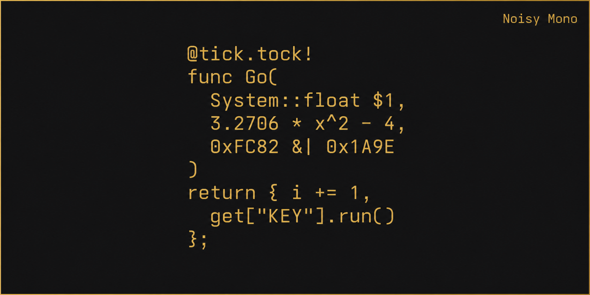
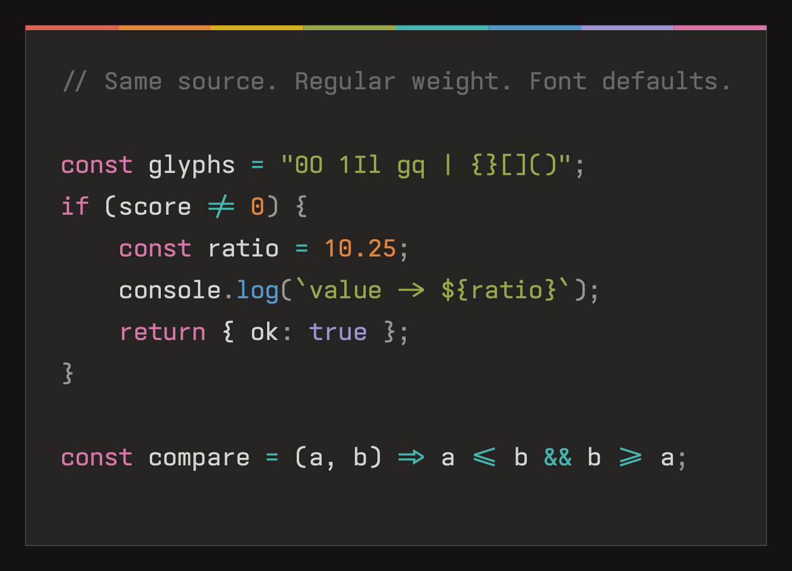
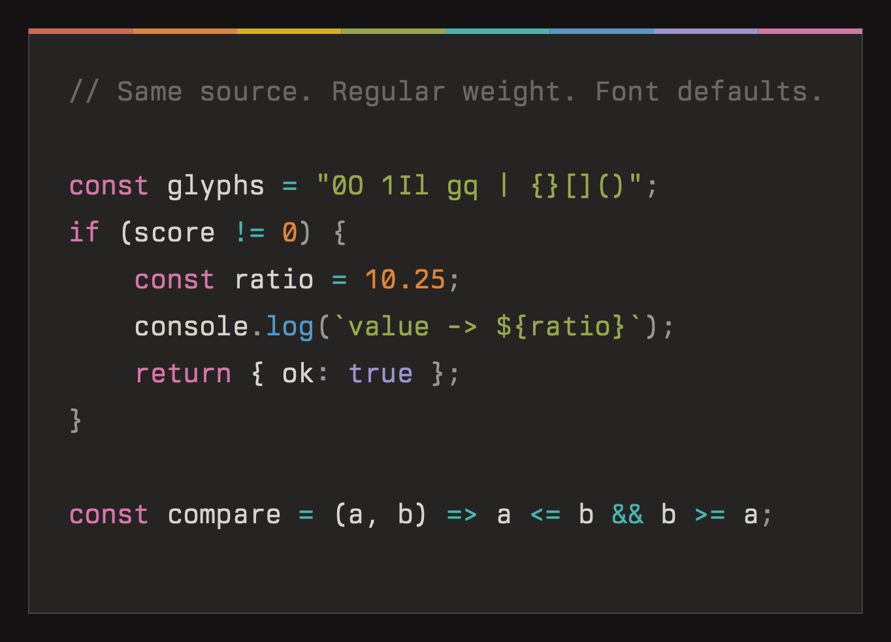

# Noisy Mono



A free, open-source alternative to [Berkeley Mono](https://berkeleygraphics.com/typefaces/berkeley-mono/) — built by configuring [Iosevka](https://github.com/be5invis/Iosevka) to match its look and feel as closely as possible.

Noisy Mono is an independently maintained derivative of
[Ioskeley Mono](https://github.com/ahatem/IoskeleyMono).

---

## Live Preview

See Noisy Mono in action with real-time editable samples, multiple programming languages, and side-by-side comparison with Berkeley Mono:

**[→ Open Interactive Showcase](https://nsyout.github.io/NoisyMono/)**

---

## Static Preview

| Noisy Mono | Berkeley Mono |
| --- | --- |
|  |  |

> Rendered from the same source with the same canvas, size, Flexoki Dark
> colors, and macOS Core Text renderer. The committed comparison uses Noisy
> Mono Regular v34.4.0 and a locally licensed Berkeley Mono Regular v2.004;
> no Berkeley font files are distributed by this repository. Exact render
> metadata is recorded in
> [`site/imgs/comparison-provenance.json`](site/imgs/comparison-provenance.json).


> Theme: [Kanagawa Dragon Theme](https://plugins.jetbrains.com/plugin/27101-kanagawa-dragon-theme)

---

## Installation

Download the latest release from the [Releases page](https://github.com/nsyout/NoisyMono/releases).

### Which file do I need?

| Situation | Download |
|---|---|
| Editor or IDE (VS Code, JetBrains, Zed…) | `NoisyMono.zip` |
| Terminal with icons (Neovim, Starship…) | `NoisyMono-NerdFont.zip` |
| Arrows or box-drawing look wrong in my terminal | `NoisyMono-Term.zip` |
| Terminal with icons _and_ rendering issues | `NoisyMono-Term-NerdFont.zip` |
| App that can't disable ligatures (Xcode…) | `NoisyMono-NL.zip` |
| Same, but also need Nerd Font icons | `NoisyMono-NL-NerdFont.zip` |
| Web / CSS, Latin and technical symbols | `NoisyMono-Web.zip` |
| Web / CSS, complete glyph repertoire | `NoisyMono-Web-Full.zip` |

> **Not sure?** Start with `NoisyMono.zip`.

### Webfonts

The default web archive contains unhinted, curated subsets rather than the
roughly 500 KB full-glyph file for every face. It retains Latin and Latin
Extended, combining marks, punctuation, currency, arrows, math and technical
symbols, box drawing, geometric symbols, common Latin ligatures, and all
OpenType layout features supported by the included glyphs.

All weights, styles, and widths are included with a ready-to-use CSS file.
Unsupported scripts fall back according to your CSS font stack. Choose
`NoisyMono-Web-Full.zip` when a site needs the complete Iosevka glyph
repertoire. See [`webfonts/README.md`](webfonts/README.md) for usage and
regeneration details.

### What's inside each TTF zip?

Every TTF zip contains all three widths, each with hinted and unhinted variants:

```
Normal/
  Hinted/    ← standard-DPI screens (most Windows setups)
  Unhinted/  ← high-DPI / Retina (macOS, Linux HiDPI)
SemiCondensed/
  Hinted/
  Unhinted/
Condensed/
  Hinted/
  Unhinted/
```

Install all fonts in your chosen folder — your OS will expose the full weight axis (Thin → Black) automatically. Start with `Normal/` if you're unsure which width you prefer.

### Installing the fonts

1. Download and unzip your chosen file
2. Open the width and hint folder that matches your setup
3. Select all `.ttf` files and install:
   - **macOS** — double-click any font → Install Font, or drag all into Font Book
   - **Windows** — select all → right-click → Install for all users
   - **Linux** — copy to `~/.local/share/fonts/` then run `fc-cache -fv`

### About the Term variant

`Noisy Mono Term` uses Iosevka's `fontconfig-mono` spacing. Every
non-combining glyph occupies one cell, allowing Fontconfig, KDE, and fixed-width
font pickers to recognize it reliably. It also exports glyph names required for
programming ligatures in Kitty.

Strict one-cell spacing omits a small set of inherently wide symbols, including
long-arrow characters. Use the standard family when complete glyph coverage is
more important than strict terminal classification.

### About the Nerd Font variants

Nerd Font archives are patched in Mono mode. Their icons and existing glyphs
are normalized to one cell, and their fixed-pitch metadata is validated before
packaging. This makes the installed `Nerd Font Mono` families suitable for
terminal and fixed-width font pickers.

### About the NL variant

`Noisy Mono NL` has all ligature substitutions disabled. Use it in apps that can't toggle ligatures off themselves (e.g. Xcode). Everything else — weights, widths, glyph shapes, metrics — is identical to the standard variant.

### Slashed zero

The slashed zero is the default glyph in every Noisy Mono build. No OpenType
feature or application-specific setting is required.

---

## Weights

Noisy Mono matches Berkeley Mono's full weight axis across all widths:

| Weight | CSS value |
|---|---|
| Thin | 100 |
| ExtraLight | 200 |
| Light | 300 |
| SemiLight | 350 |
| Regular | 400 |
| Medium | 500 |
| SemiBold | 600 |
| Bold | 700 |
| ExtraBold | 800 |
| Black | 900 |

Every weight is available in all three widths, both Upright and Italic.

---

## Design Choices

Noisy Mono uses specific character variants and custom metrics to closely match Berkeley Mono's aesthetic.

**Custom metrics** — vertical proportions, letter spacing, and parenthesis size are tuned to capture Berkeley's compact, geometric feel.

**Distinctive glyphs** — single-storey `g`, flat-arc parentheses `()`, two-circle `8`, slashed `0`, open-contour `6` and `9`, square punctuation dots, and a raised underscore.

For the full list of configuration choices, see [`private-build-plans.toml`](./private-build-plans.toml).

---

## Building from Source

The font is built automatically via GitHub Actions on every version tag push. To build locally:

```bash
git clone https://github.com/nsyout/NoisyMono.git
IOSEVKA_TAG="$(jq -r '.iosevka.tag' NoisyMono/.github/font-toolchain.json)"
git clone --branch "$IOSEVKA_TAG" --depth 1 https://github.com/be5invis/Iosevka.git

cp NoisyMono/private-build-plans.toml Iosevka/
cd Iosevka
npm ci
npm run build -- contents::NoisyMono contents::NoisyMonoTerm contents::NoisyMonoNL
```

Output will be in the corresponding family folders under `Iosevka/dist/`.
The stable Iosevka tag used by releases is recorded in
`.github/font-toolchain.json`.

---

## Contributing

This project is just a build configuration on top of Iosevka — changes are often just a few lines in `private-build-plans.toml`. If you spot something off or have an idea, open an issue or send a PR. All contributions are welcome!

Fork release and upstream-sync notes live in
[`MAINTAINING.md`](MAINTAINING.md).

---

## License & Credits

Noisy Mono descends from
[Ioskeley Mono](https://github.com/ahatem/IoskeleyMono) by Ahmed Hatem and is
built with [Iosevka](https://github.com/be5invis/Iosevka) by Renzhi Li
(Belleve Invis) and its contributors. No endorsement by either upstream project
is implied.

Licensed under the [SIL Open Font License 1.1](./LICENSE). See
[`FONTLOG.txt`](./FONTLOG.txt) for lineage and modification history.
